```{=html}
<style>

.anchorjs-link {
  display: none !important;
}

/* Estilos para la cuadrícula del equipo */
.team-grid {
  display: grid;
  grid-template-columns: repeat(auto-fill, minmax(250px, 1fr));
  gap: 30px;
  margin-bottom: 50px;
}

/* Estilo de la tarjeta individual */
.team-card {
  background: #fff;
  padding: 30px 20px;
  border: 1px solid #eee;
  border-radius: 12px;
  display: flex;
  flex-direction: column;
  align-items: center; /* Centrado horizontal */
  text-align: center;  /* Texto centrado */
  box-shadow: 0 4px 10px rgba(0,0,0,0.03);
  transition: transform 0.2s, box-shadow 0.2s;
}

.team-card:hover {
  transform: translateY(-5px);
  box-shadow: 0 8px 20px rgba(0,0,0,0.08);
}

/* Estilo de la imagen CIRCULAR */
.team-card img {
  width: 160px;        /* Tamaño fijo */
  aspect-ratio: 1 / 1;
  border-radius: 50%;  /* Círculo perfecto */
  object-fit: cover;
  margin-bottom: 15px;
  background-color: #f8f9fa;
  border: 4px solid #fff;
  box-shadow: 0 4px 8px rgba(0,0,0,0.1);
}

/* Tipografía */
.member-name {
  color: #2c3e50;
  font-weight: 700;
  font-size: 1.15em;
  margin: 10px 0 5px 0;
}


.member-inst {
  font-size: 0.9em;
  color: #666;
  margin-bottom: 20px; /* Espacio antes del botón */
  font-style: italic;
}

/* Nuevo Botón de Perfil (LinkedIn/ORCID) */
.profile-btn {
  background-color: #0077b5; /* Azul LinkedIn */
  color: #fff !important;
  padding: 8px 16px;
  font-size: 0.8em;
  font-weight: 600;
  text-decoration: none;
  border-radius: 20px; /* Botón tipo cápsula */
  transition: background-color 0.2s;
  display: inline-block;
}

.profile-btn:hover {
  background-color: #005582;
  text-decoration: none;
}

</style>
```


<div class="team-grid">

<div class="team-card">
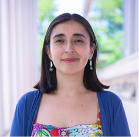
<h3 class="member-name">María Elisa Quinteros Cáceres, PhD</h3>
<p class="member-inst">Epidemióloga Ambiental</p>
<a href="https://orcid.org/0000-0001-8815-1513" class="profile-btn" target="_blank">ORCID</a>
</div>

<div class="team-card">
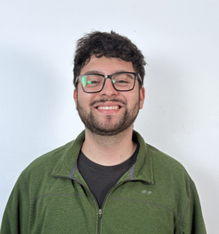
<h3 class="member-name">Felipe Gallardo Altamirano, MSc</h3>
<p class="member-inst">Ingeniero Civil Ambiental</p>
<a href="https://cl.linkedin.com/in/felipe-gallardo-altamirano-7406b4271" class="profile-btn" target="_blank">LinkedIn</a>
</div>

<div class="team-card">
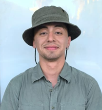
<h3 class="member-name">Felipe Alarcón Cárcamo</h3>
<p class="member-inst">Estudiante de Ingeniería Ambiental </p>
</div>

<div class="team-card">
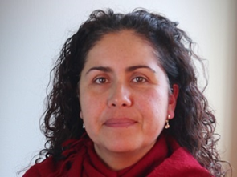
<h3 class="member-name">Pamela Cuevas Alcayaga, MSc</h3>
<p class="member-inst">Matrona</p>
<a href="https://cl.linkedin.com/in/pamela-l-cuevas-alcayaga-a1073b263" class="profile-btn" target="_blank">LinkedIn</a>
</div>

<div class="team-card">

<h3 class="member-name">Loreto Núñez Franz, MSc</h3>
<p class="member-inst">Epidemióloga</p>
<a href="https://cl.linkedin.com/in/maria-loreto-nu%C3%B1ez-franz-667143191" class="profile-btn" target="_blank">LinkedIn</a>
</div>

<div class="team-card">

<h3 class="member-name">Raul Núñez Navarro</h3>
<p class="member-inst">Diseñador Gráfico</p>
<a href="https://cl.linkedin.com/in/raulnuneznavarro" class="profile-btn" target="_blank">LinkedIn</a>
</div>

<div class="team-card">

<h3 class="member-name">Monserrat Morales Gonzalez, MSc</h3>
<p class="member-inst">Nutricionista</p>
<a href="https://cl.linkedin.com/in/monserrat-morales-gonzalez-308155379" class="profile-btn" target="_blank">LinkedIn</a>
</div>

<div class="team-card">
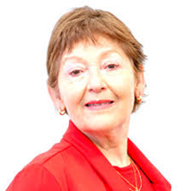
<h3 class="member-name">M° Carmen Briones Lorca, MSc</h3>
<p class="member-inst">Matrona</p>
</div>

<div class="team-card">

<h3 class="member-name">Alicia Parada Navarro, MSc</h3>
<p class="member-inst">Matrona</p>
</div>

<div class="team-card">

<h3 class="member-name">Claudio Valenzuela Monsálvez, MSc</h3>
<p class="member-inst">Matrón</p>
</div>


<div class="team-card">
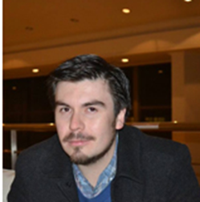
<h3 class="member-name">Miguel Vásquez Campos, MSc</h3>
<p class="member-inst">Fonoaudiólogo</p>
<a href="https://cl.linkedin.com/in/miguel-v%C3%A1squez-campos-921695337" class="profile-btn" target="_blank">LinkedIn</a>
</div>


<div class="team-card">
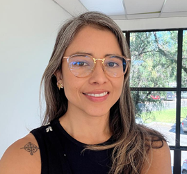
<h3 class="member-name">Daniela Quilaqueo Sáez, MSc</h3>
<p class="member-inst">Fonoaudióloga</p>
<a href="https://cl.linkedin.com/in/daniela-quilaqueo-s%C3%A1ez-15a9975b" class="profile-btn" target="_blank">LinkedIn</a>
</div>

<div class="team-card">

<h3 class="member-name">Joselyn Sothers Ruiz</h3>
<p class="member-inst">Matrona</p>
<a href="https://cl.linkedin.com/in/mat-joselyn-sothers" class="profile-btn" target="_blank">LinkedIn</a>
</div>

<div class="team-card">

<h3 class="member-name">Rogrigo Torres </h3>
<p class="member-inst">Estudiante Técnologia Medica</p>
</div>


<div class="team-card">
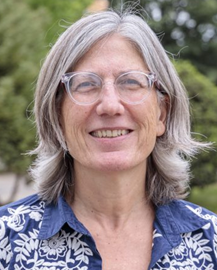
<h3 class="member-name">Gloria Icaza Noguera, PhD</h3>
<p class="member-role">Estadística</p>
<a href="https://cl.linkedin.com/in/mar%C3%ADa-gloria-icaza-noguera-76066b24" class="profile-btn" target="_blank">LinkedIn</a>
</div>

<div class="team-card">

<h3 class="member-name">Gabriel Olguín Orellana, PhD</h3>
<p class="member-role">Bioinformático</p>
<a href="https://cl.linkedin.com/in/gaboslab" class="profile-btn" target="_blank">LinkedIn</a>
</div>

<div class="team-card">
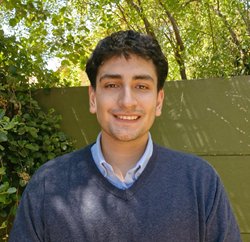
<h3 class="member-name">Martín Soto Cabezas</h3>
<p class="member-role">Ingeniero en Estadística</p>
<a href="https://cl.linkedin.com/in/mart%C3%ADn-soto-cabezas-39b40429b?trk=people-guest_people_search-card" class="profile-btn" target="_blank">LinkedIn</a>
</div>


<div class="team-card">

<h3 class="member-name">Felipe Varas Concha, PhD</h3>
<p class="member-role">Ingeniero</p>
<a href="https://cl.linkedin.com/in/felipe-gallardo-altamirano-7406b4271" class="profile-btn" target="_blank">LinkedIn</a>
</div>

<div class="team-card">
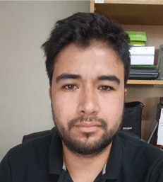
<h3 class="member-name">José Alarcón Alarcón, PhD (C)</h3>
<p class="member-role">Estudiante Doctorado</p>
<a href="https://cl.linkedin.com/in/jos%C3%A9-alarc%C3%B3n-alarc%C3%B3n" class="profile-btn" target="_blank">LinkedIn</a>
</div>

<div class="team-card">
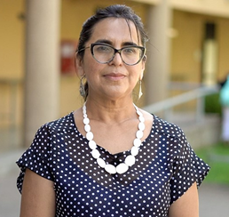
<h3 class="member-name">Erika Retamal Contreras, MSc</h3>
<p class="member-role">Epidemióloga</p>
<a href="https://cl.linkedin.com/in/erika-roxana-retamal-contreras-ab482828" class="profile-btn" target="_blank">LinkedIn</a>
</div>

<div class="team-card">

<h3 class="member-name">Roxana Orrego Castillo, MSc</h3>
<p class="member-role">Tecnóloga Médica</p>
</div>

<div class="team-card">

<h3 class="member-name">Marcela Vásquez Rojas, MSc</h3>
<p class="member-role">Tecnóloga Médica</p>
<a href="https://cl.linkedin.com/in/marcela-v%C3%A1squez-rojas-998686173" class="profile-btn" target="_blank">LinkedIn</a>
</div>

<div class="team-card">

<h3 class="member-name">Marcela Marin Salgado, MSc</h3>
<p class="member-role">Tecnóloga Médica</p>
</div>


<div class="team-card">
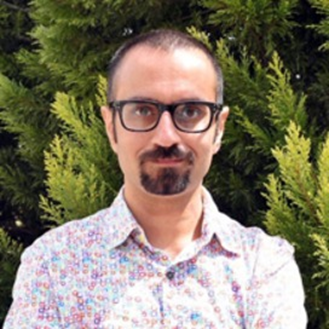
<h3 class="member-name">Payam Dadvand, MD PhD</h3>
<p class="member-role">Epidemiólogo Ambiental</p>
<p class="member-inst">ISGlobal</p>
<a href="https://orcid.org/0000-0002-2325-1027" class="profile-btn" target="_blank">ORCID</a>
</div>

<div class="team-card">

<h3 class="member-name">Suzanne Bartington, PhD</h3>
<p class="member-role">Epidemióloga</p>
<p class="member-inst">University of Birmingham</p>
<a href="https://uk.linkedin.com/in/suzannebartington" class="profile-btn" target="_blank">LinkedIn</a>
</div>


</div>

```{=html}
<nav class="epigest-mobile-nav" id="epigest-mobile-nav">
  <a href="index.html">
    <i class="bi bi-house-fill"></i>
    <span>Inicio</span>
    <div class="epigest-dot"></div>
  </a>
  <a href="equipo.html">
    <i class="bi bi-people-fill"></i>
    <span>Equipo</span>
    <div class="epigest-dot"></div>
  </a>
  <a href="novedades.html">
    <i class="bi bi-newspaper"></i>
    <span>Noticias</span>
    <div class="epigest-dot"></div>
  </a>
  <a href="https://www.instagram.com/epigest.talca/" target="_blank" rel="noopener">
    <i class="bi bi-instagram"></i>
    <span>Instagram</span>
    <div class="epigest-dot"></div>
  </a>
  <a href="mailto:epigestalca@utalca.cl">
    <i class="bi bi-envelope-fill"></i>
    <span>Contacto</span>
    <div class="epigest-dot"></div>
  </a>
</nav>

<script>
(function () {
  // Marcar el link activo según la página actual
  var current = window.location.pathname.split('/').pop() || 'index.html';
  if (current === '' || current === '/') current = 'index.html';
  var links = document.querySelectorAll('#epigest-mobile-nav a');
  links.forEach(function(a) {
    var href = a.getAttribute('href');
    if (href && current && href !== '' && !href.startsWith('http') && !href.startsWith('mailto')) {
      if (href === current || (current === '' && href === 'index.html')) {
        a.classList.add('active');
      }
    }
  });
})();
</script>
```