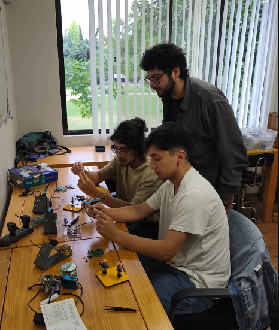
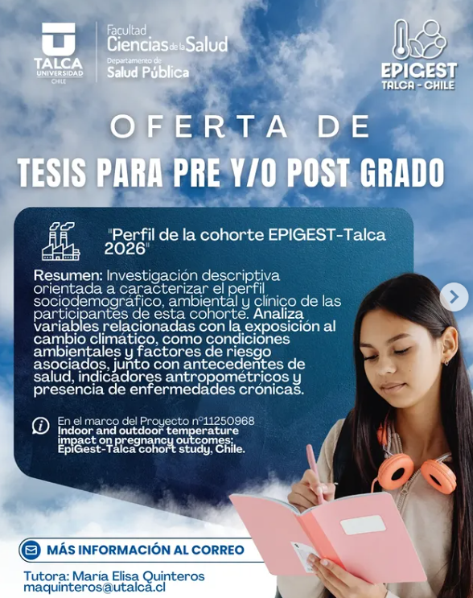
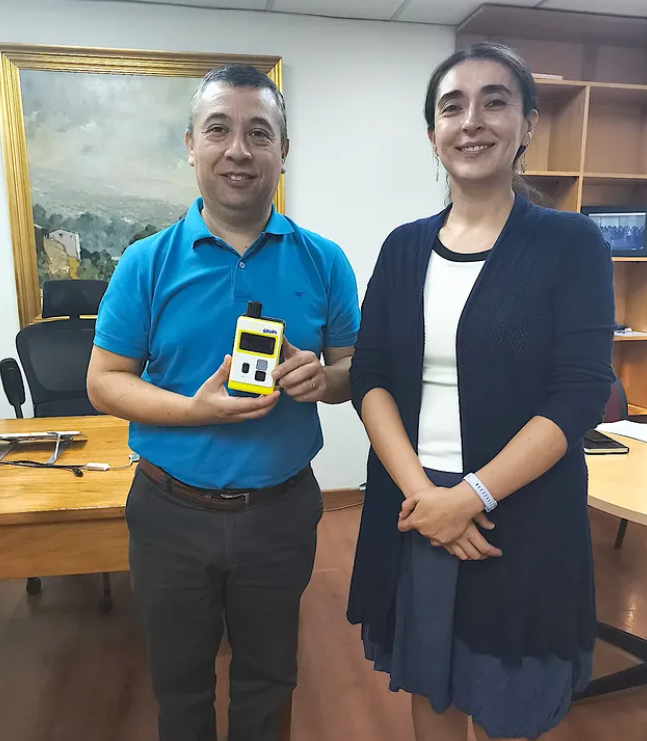

# Estudio de Cohorte EpiGest

**Investigando el impacto del ambiente en el inicio de la vida.**

El **Estudio de Cohorte de Epidemiología Gestacional (EpiGest)** es un proyecto de investigación pionero en Chile, que busca comprender cómo las condiciones ambientales a las que se expone una madre durante el embarazo influyen en su salud y en el desarrollo de su bebé.

---

::: {.callout-note}
## Participación

El reclutamiento de voluntarias se realiza en colaboración con los Centros de Salud Familiar (CESFAM) de Talca. Si estás embarazada y te interesa contribuir a la ciencia local, ¡contáctanos!

  <a href="mailto:epigestalca@utalca.cl" class="btn-contacto">
    <i class="bi bi-envelope-fill"></i> Enviar Correo
  </a>

:::

<h2>Novedades en Instagram</h2>

  

  

  

  

  <a href="https://www.instagram.com/epigest.talca/" target="_blank" class="btn-instagram">
    <i class="bi bi-instagram"></i> Síguenos en Instagram
  </a>

